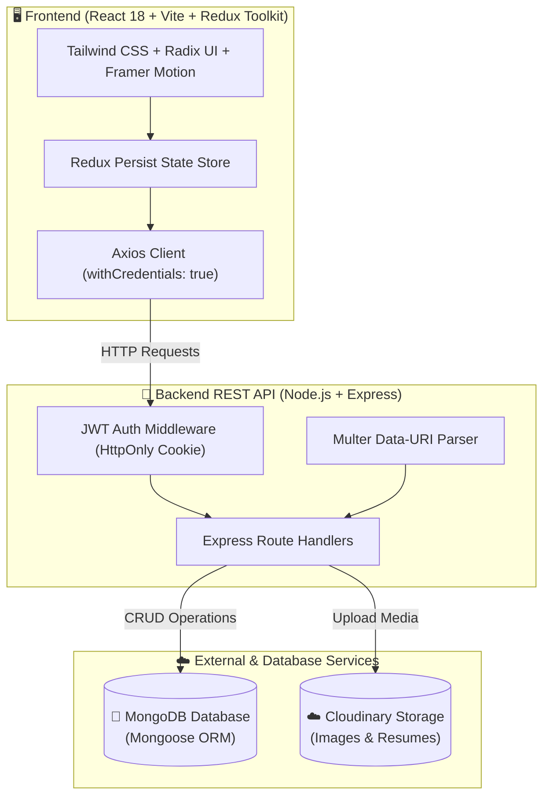

<div align="center">

# 💼 TalentSpot — Next-Gen Job Portal & Recruitment Platform

<p align="center">
  <strong>A modern, full-stack career platform connecting ambitious talent with visionary recruiters.</strong>
</p>

[](https://react.dev/)
[](https://vitejs.dev/)
[](https://nodejs.org/)
[](https://expressjs.com/)
[](https://www.mongodb.com/)
[](https://tailwindcss.com/)
[](https://redux-toolkit.js.org/)
[](https://cloudinary.com/)
[](https://jwt.io/)
[](LICENSE)

<br/>

[✨ Features](#-key-features) •
[🏗️ Architecture](#️-architecture--data-flow) •
[🛠️ Tech Stack](#-technology-stack) •
[📂 Project Structure](#-project-structure) •
[⚡ Quick Start](#-installation--setup) •
[📡 API Reference](#-rest-api-documentation) •
[🗺️ Routes](#️-frontend-routes-directory) •
[👥 Team](#-project-team--contributors) •
[🚀 Deployment](#-deployment-guide)

---

</div>

## 🌟 Overview

**TalentSpot** is a comprehensive, production-grade recruitment ecosystem designed to streamline the hiring process. Built with a responsive **React 18 + Vite** frontend and a robust **Node.js + Express** REST API, TalentSpot offers dedicated workflows for both **job seekers** (students/professionals) and **recruiters** (employers).

### 🎯 Key Highlights
- 🔐 **Secure HttpOnly Cookie Authentication** with JSON Web Tokens and Bcrypt password hashing.
- ⚡ **Instant Search & Multi-Filter Engine** for titles, locations, industries, and salary ranges.
- 🏢 **Recruiter Control Center** for company profiles, logo branding, job management, and applicant tracking.
- 📄 **Cloud-Powered Media Storage** via Multer & Cloudinary for instant resume uploads and company logos.
- 🎨 **State-of-the-Art UI/UX** powered by Tailwind CSS, Radix UI primitives, Framer Motion animations, and Sonner toasts.

---

## ✨ Key Features

### 👨‍🎓 For Candidates & Job Seekers

| Feature | Description |
| :--- | :--- |
| 🔍 **Intelligent Job Search** | Search jobs dynamically by title, skill keywords, company name, or location. |
| 🎛️ **Multi-Parameter Filtering** | Filter postings by industry domain, geographic location, and compensation range. |
| ⚡ **One-Click Application** | Apply to jobs seamlessly with duplicate prevention and real-time status tracking. |
| 👤 **Profile & Resume Studio** | Manage personal bio, skill tags, contact details, profile photo, and downloadable PDF resume. |
| 📊 **Application Dashboard** | Track all submitted applications with dynamic status tags (`Pending`, `Accepted`, `Rejected`). |

### 🏢 For Recruiters & Employers

| Feature | Description |
| :--- | :--- |
| 🏢 **Company Management** | Register and maintain multiple enterprise profiles with logos, website URLs, and descriptions. |
| 📝 **Job Posting Studio** | Create rich job postings specifying requirements, salary, openings, location, and experience level. |
| 👥 **Applicant Review Pipeline** | View all candidate submissions per job with direct resume download links and profile overviews. |
| 🔄 **Status Decisioning** | Accept or reject applications instantly with automated status synchronization. |
| 🛡️ **Role-Guarded Access** | Protected recruiter dashboard routes preventing unauthorized candidate access. |

---

## 🏗️ Architecture & Data Flow



---

## 🛠️ Technology Stack

<table width="100%">
  <thead>
    <tr>
      <th width="20%">Layer</th>
      <th width="35%">Technologies</th>
      <th width="45%">Purpose & Capabilities</th>
    </tr>
  </thead>
  <tbody>
    <tr>
      <td><strong>Frontend</strong></td>
      <td>
        
        
        
        
      </td>
      <td>Component architecture, client-side routing, global state synchronization, and persistent storage.</td>
    </tr>
    <tr>
      <td><strong>Styling & UI</strong></td>
      <td>
        
        
        
        
      </td>
      <td>Accessible UI primitives, responsive styling, micro-animations, carousel sliders, and toast feedback.</td>
    </tr>
    <tr>
      <td><strong>Backend</strong></td>
      <td>
        
        
        
        
      </td>
      <td>Modular MVC architecture, RESTful API controllers, password hashing, and cookie-based JWT sessions.</td>
    </tr>
    <tr>
      <td><strong>Data & Media</strong></td>
      <td>
        
        
        
        
      </td>
      <td>Document schema validation, relational referencing (users, jobs, companies, applications), and cloud media storage.</td>
    </tr>
  </tbody>
</table>

---

## 📂 Project Structure

```text
IBM_JOB_Portel/
├── 📁 backend/                        # Express.js REST API Server
│   ├── 📁 controllers/                # Business logic handlers
│   │   ├── application.controller.js  # Apply, applicant review, status update
│   │   ├── company.controller.js      # Company registration and updates
│   │   ├── job.controller.js          # Job creation, discovery, filtering
│   │   └── user.controller.js         # Authentication, profile & resume
│   ├── 📁 middlewares/                # Authentication & upload processors
│   │   ├── isAuthenticated.js         # JWT cookie validation middleware
│   │   └── mutler.js                  # Multipart form file handling
│   ├── 📁 models/                     # Mongoose Schema Definitions
│   │   ├── application.model.js       # Job application entity
│   │   ├── company.model.js           # Recruiter company entity
│   │   ├── job.model.js               # Job listing entity
│   │   └── user.model.js              # User & candidate profile entity
│   ├── 📁 routes/                     # REST API Route Declarations
│   ├── 📁 utils/                      # DB connection, Cloudinary, datauri helpers
│   ├── 📄 index.js                    # Server bootstrap & CORS configuration
│   └── 📄 package.json                # Backend dependencies & start scripts
│
├── 📁 frontend/                       # Vite + React Client Application
│   ├── 📁 src/
│   │   ├── 📁 components/             # React View Components
│   │   │   ├── 📁 admin/              # Recruiter management views
│   │   │   ├── 📁 auth/               # Login & Register views
│   │   │   ├── 📁 shared/             # Navbar, Footer, Reusable dialogs
│   │   │   ├── 📁 ui/                 # Radix UI primitives & theme controls
│   │   │   ├── 📄 Browse.jsx          # Search and filter listings view
│   │   │   ├── 📄 FilterCard.jsx      # Multi-criteria filter sidebar
│   │   │   ├── 📄 HeroSection.jsx     # Landing hero with animated search
│   │   │   ├── 📄 JobDescription.jsx  # Detailed job view & one-click apply
│   │   │   ├── 📄 Jobs.jsx            # Job discovery feed
│   │   │   └── 📄 Profile.jsx         # Candidate profile & applications
│   │   ├── 📁 hooks/                  # Custom data-fetching hooks
│   │   ├── 📁 redux/                  # Redux Toolkit slices (auth, job, company)
│   │   ├── 📁 utils/                  # API endpoints and axios constants
│   │   ├── 📄 App.jsx                 # Route tree & ProtectedRoute wrappers
│   │   └── 📄 main.jsx                # DOM mounting & Redux Provider setup
│   └── 📄 package.json                # Frontend dependencies & build scripts
│
└── 📄 README.md                       # Master Documentation
```

---

## ⚡ Installation & Setup

### 📋 Prerequisites
Make sure you have the following installed on your machine:
- **Node.js**: `v18.0.0` or higher ([Download](https://nodejs.org/))
- **npm**: `v9.0.0` or higher
- **MongoDB**: Local instance running on port `27017` or a [MongoDB Atlas](https://www.mongodb.com/cloud/atlas) cluster URI
- **Cloudinary Account**: Free API keys from [Cloudinary Console](https://cloudinary.com/)

---

### 1️⃣ Clone the Repository

```bash
git clone https://github.com/SanjayBarman15/IBM_JOB_Portel.git
cd IBM_JOB_Portel
```

---

### 2️⃣ Configure Backend Environment

Navigate to the `backend` directory and install dependencies:

```bash
cd backend
npm install
```

Create a `.env` file inside the `backend/` folder:

```env
# Server Port
PORT=8000

# MongoDB Database Connection String
MONGO_URI=mongodb://127.0.0.1:27017/talentspot
# Note: MONGODB_URI is also supported as an alias

# JWT Secret Key for Session Authentication
JWT_SECRET=your_super_secret_jwt_key_here

# Cloudinary Media Configuration
CLOUD_NAME=your_cloudinary_cloud_name
API_KEY=your_cloudinary_api_key
API_SECRET=your_cloudinary_api_secret
```

> [!WARNING]
> Never commit your `.env` file or expose your Cloudinary API secrets and JWT Secret to public repositories.

---

### 3️⃣ Configure Frontend

Open a new terminal window, navigate to the `frontend` directory, and install dependencies:

```bash
cd frontend
npm install
```

---

### 4️⃣ Run the Full Application

#### Start Backend Server
```bash
cd backend
npm start
```
> Server will start on **`http://localhost:8000`** with Nodemon hot-reloading.

#### Start Frontend Client
```bash
cd frontend
npm run dev
```
> Client will launch on **`http://localhost:5173`**.

---

## 📡 REST API Documentation

Base URL: `http://localhost:8000/api/v1`

### 👤 User & Authentication Endpoints

| Method | Endpoint | Access | Description |
| :--- | :--- | :---: | :--- |
| `POST` | `/user/register` | 🔓 Public | Register a new student or recruiter account |
| `POST` | `/user/login` | 🔓 Public | Authenticate user and issue HttpOnly JWT cookie |
| `GET` | `/user/logout` | 🔒 Authenticated | Invalidate session and clear auth cookie |
| `GET` | `/user/profile` | 🔒 Authenticated | Retrieve profile details of logged-in user |
| `POST` | `/user/profile/update` | 🔒 Authenticated | Update user bio, skills, resume PDF, and avatar |

### 🏢 Company Endpoints

| Method | Endpoint | Access | Description |
| :--- | :--- | :---: | :--- |
| `POST` | `/company/register` | 🔒 Recruiter | Register a new company entity |
| `GET` | `/company/get` | 🔒 Recruiter | Fetch all companies created by authenticated recruiter |
| `GET` | `/company/get/:id` | 🔒 Recruiter | Get specific company by ID |
| `PUT` | `/company/update/:id` | 🔒 Recruiter | Update company profile details and brand logo |

### 💼 Job Endpoints

| Method | Endpoint | Access | Description |
| :--- | :--- | :---: | :--- |
| `POST` | `/job/post` | 🔒 Recruiter | Create and publish a new job posting |
| `GET` | `/job/get` | 🔓 Public | Query and filter active jobs with search keyword support |
| `GET` | `/job/get/:id` | 🔓 Public | Retrieve detailed job specifications and company info |
| `GET` | `/job/getadminjobs` | 🔒 Recruiter | List all postings authored by the recruiter |

### 📄 Application Endpoints

| Method | Endpoint | Access | Description |
| :--- | :--- | :---: | :--- |
| `GET` | `/application/apply/:id` | 🔒 Student | Submit an application for a designated job |
| `GET` | `/application/get` | 🔒 Student | Retrieve all applications submitted by candidate |
| `GET` | `/application/:id/applicants` | 🔒 Recruiter | Review candidate roster for a specific job |
| `POST` | `/application/status/:id/update` | 🔒 Recruiter | Update candidate application status (`accepted`/`rejected`) |

---

## 🗺️ Frontend Routes Directory

| Route | View Component | Access Role | Description |
| :--- | :--- | :---: | :--- |
| `/` | `Home.jsx` | 🌍 Public | Landing page with Hero, Categories & Latest Jobs |
| `/login` | `Login.jsx` | 🌍 Public | User & recruiter login portal |
| `/signup` | `Signup.jsx` | 🌍 Public | Multi-role registration portal |
| `/jobs` | `Jobs.jsx` | 🌍 Public | Job feed with real-time multi-filter sidebar |
| `/browse` | `Browse.jsx` | 🌍 Public | Search result listings |
| `/description/:id` | `JobDescription.jsx` | 🌍 Public / Candidate | Job spec overview with one-click apply button |
| `/profile` | `Profile.jsx` | 🎓 Candidate | Candidate profile, skill tags, resume & applied jobs |
| `/admin/companies` | `Companies.jsx` | 👔 Recruiter Only | Registered company management dashboard |
| `/admin/companies/create` | `CompanyCreate.jsx` | 👔 Recruiter Only | Company onboarding wizard |
| `/admin/companies/:id` | `CompanySetup.jsx` | 👔 Recruiter Only | Edit company details, logo, and website |
| `/admin/jobs` | `AdminJobs.jsx` | 👔 Recruiter Only | Recruiter posted job directory |
| `/admin/jobs/create` | `PostJob.jsx` | 👔 Recruiter Only | Multi-field job creation studio |
| `/admin/jobs/:id/applicants` | `Applicants.jsx` | 👔 Recruiter Only | Candidate review and status decisioning |

---

## 🚀 Deployment Guide

<details>
<summary><strong>🌐 Deploying the Frontend (Vercel / Netlify)</strong></summary>

1. Push your code to GitHub.
2. Link the repository to **Vercel** or **Netlify**.
3. Set the Root Directory to `frontend`.
4. Set the Build Command to `npm run build` and Output Directory to `dist`.
5. Ensure `frontend/src/utils/constant.js` points to your deployed backend API URL:
   ```javascript
   export const USER_API_END_POINT = "https://your-backend-domain.com/api/v1/user";
   export const JOB_API_END_POINT = "https://your-backend-domain.com/api/v1/job";
   export const APPLICATION_API_END_POINT = "https://your-backend-domain.com/api/v1/application";
   export const COMPANY_API_END_POINT = "https://your-backend-domain.com/api/v1/company";
   ```
</details>

<details>
<summary><strong>⚙️ Deploying the Backend (Render / Railway / Fly.io)</strong></summary>

1. Link your repository to **Render** or **Railway**.
2. Set Root Directory to `backend`.
3. Set Build Command to `npm install` and Start Command to `node index.js`.
4. Add all environment variables from `.env` in the dashboard settings:
   - `PORT=8000`
   - `MONGO_URI=mongodb+srv://<user>:<password>@cluster.mongodb.net/talentspot`
   - `JWT_SECRET=production_strong_secret`
   - `CLOUD_NAME`, `API_KEY`, `API_SECRET`
5. In `backend/index.js`, update CORS origins to include your production frontend domain and configure `sameSite: 'none'`, `secure: true` on cookies for cross-site authentication.
</details>

---

## 👥 Project Team & Contributors

| Student Name | Enrollment Number | Program & Batch | University / Institution |
| :--- | :--- | :--- | :--- |
| 🎓 **Md Ayan Qurashi** | `ADTU/0/2025-27/MCAM030` | MCA (2025–2027) | Assam Down Town University (ADTU) |
| 🎓 **Sumitra Devi** | `ADTU/0/2025-27/MCAM029` | MCA (2025–2027) | Assam Down Town University (ADTU) |
| 🎓 **Sanjay Barman** | `ADTU/0/2025-27/MCAM027` | MCA (2025–2027) | Assam Down Town University (ADTU) |

---

## 🤝 Contributing

Contributions make the open-source community an incredible place to learn, inspire, and create. Any contributions you make are **greatly appreciated**!

1. Fork the Project
2. Create your Feature Branch (`git checkout -b feature/AmazingFeature`)
3. Commit your Changes (`git commit -m 'Add some AmazingFeature'`)
4. Push to the Branch (`git push origin feature/AmazingFeature`)
5. Open a Pull Request

---

## 📄 License

This project is licensed under the **ISC License**. See the `LICENSE` file for more information.

<div align="center">
  <sub>Built with ❤️ by <strong>Md Ayan Qurashi</strong>, <strong>Sumitra Devi</strong>, and <strong>Sanjay Barman</strong> (ADTU). If you found this project helpful, give it a ⭐️ on GitHub!</sub>
</div>
